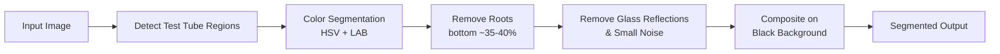

# 🌱 Plant Tissue Segmentation

Computer vision pipeline that isolates plant leaves/stems from in-vitro test tube images — removes glass, background, and roots for clean, analysis-ready output.


## Example

| Input | Segmented Output |
|---|---|
|  |  |

| Input | Segmented Output |
|---|---|
|  |    |


## Features

- 🧪 Auto-detects up to 8 test tubes per image (contour-based, falls back to equal-width slicing)
- 🍃 Extracts leaves + stems only, using combined HSV + LAB color segmentation
- 🚫 Excludes roots by masking the lower portion of each tube
- ✨ Strips glass reflections and bright/dark artifacts
- 🖼️ Outputs segmented plants on a clean black background, in original spatial position
- 📊 Side-by-side input/output comparison generator

## Pipeline



## Project Structure

```
plant-tissue-segmentation/
├── plant_segmentation.py       # Baseline segmentation pipeline
├── improved_segmentation.py    # Enhanced accuracy (HSV + LAB, stricter filtering)
├── visualize_results.py        # Generates input/output comparison images
├── requirements.txt
├── input/                      # Place source images here
├── output/                     # Segmented results are written here
└── assets/                     # Example images used in this README
```

## Installation

```bash
git clone https://github.com/<your-username>/plant-tissue-segmentation.git
cd plant-tissue-segmentation
pip install -r requirements.txt
```

## Usage

```bash
# 1. Add images to input/
# 2. Run the pipeline
python plant_segmentation.py          # baseline
python improved_segmentation.py       # recommended, higher accuracy

# 3. (optional) Generate side-by-side comparisons
python visualize_results.py
```

Outputs are saved to `output/`, comparisons to `comparisons/`.

## Tuning

**Root cutoff** — controls how much of the tube's lower section is discarded:
```python
# improved_segmentation.py -> remove_roots_aggressive()
cutoff = int(height * 0.60)   # keep top 60%
```

**Green color range** — widen/narrow to capture different plant shades:
```python
lower1 = np.array([35, 40, 30])
upper1 = np.array([85, 255, 255])
```

## License

MIT
